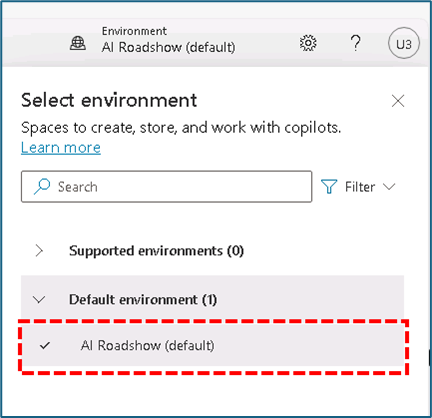
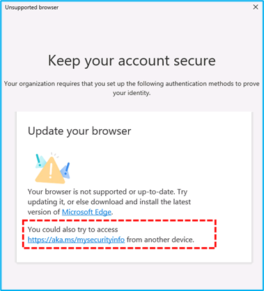
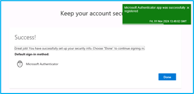
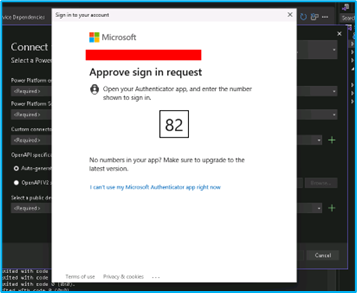
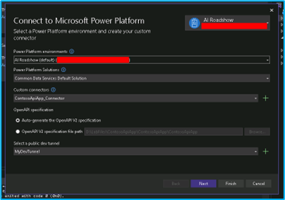
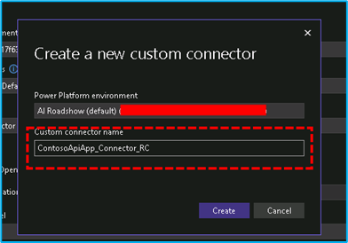
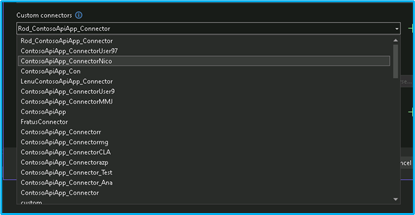
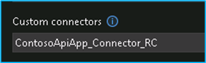
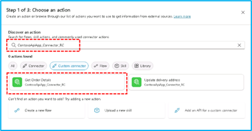

# Build and extend copilots with Copilot Studio 

To help you with the Workshop, there are answers to questions you may have to help you complete this workshop.

## Table of contents
{:toc .text-delta }

 

## There is no environment created.
You can use the default environment **AI Roadsho (default)**.

## I added the copilot to the teams but it failed.
You can try adding a second time, the copilot will be successfully added to Teams.

## In Visual Studio I am unable to authenticate with the provided credentials.

When authenticating, choose the option **"You could also try access … from another device"**.

Next you will configure Microsoft Entra multifactor authentication (MFA) with Microsoft Authenticator.
- [Google Play](https://play.google.com/store/apps/details?id=com.azure.authenticator)
- [Apple App Store](https://apps.apple.com/us/app/microsoft-authenticator/id983156458)

Then you must log in again and is able to authenticate.

## It is not possible to use the name of the Custom connector as shown in the exercise.

As you are using the tenant by default, the name you are using has already been chosen and used by another participant. You have to define a different name that is unique.

> Note: The name must be unique so as not to conflict with another existing name.  
> 

## In Microsoft Copilot, I can't find the 'Get Order Details' or 'Update delivery' actions for the custom connector I created.

The most effective way is to do the search as in the name of the created connector.

