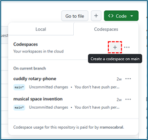

# Build a Multi-tasking Assistant with Azure OpenAI 

To help you with the Workshop, there are answers to questions you may have to help you complete this workshop.


## I can't launch the workshop environment.


You must clear the browser cache or open Workshop link in a ‘InPrivate Window’ (Edge) or ‘Private Window’ (Firefox).


## I don't find the option to create codespace on main.

1. Click **codespaces**.
2. Click the **+** button.




## I am getting an error when running **azd env refresh -e AITOUR######**.

If you receive the error message **ERROR: retrieving deployment: error retrieving state: retrieving deployment: 'AITOUR######': no ​​deployments found** this error occurs because there are still resources that are being deployed.


It is recommended that you wait for 5 minutes and try the command again. If the error message persists, they should wait another 5 minutes and try again.


## I'm getting the error **'pgp: flag failure: No secret key'** when running the command to create GitHUB shares.

You must create a GPG (GNU Privacy Guard) key in the terminal to be used with Git.

1. To create GPG use the following command.

    ```bash
    gpg --full-generate-key
    ```

1. Define the required GPG fields:
    - Please select what kind of key you want: RSA and RSA (default)
    - What keysize do you want?: 4096
    - Key is valid for?: 1y
    - Is this correct? (y/N): y
    - Real name: participant real name
    - Email address:  Email address used in GitHub account

1. After creating the GPG key you must configure the key in Git.

1. You must run the following command to get the created key.

    ```bash
    gpg --list-secret-keys --keyid-format=long
    ```

1.  You must run the following command to configure the key in Git. You have to use the key that appears as sec (primary section).

    ```bash
    git config --global user.signingkey <key>
    ```
    

1.  To avoid getting the "Ioctl not suitable for device" error.

    ```bash
    export GPG_TTY=$(tty)
    ```

1. After setting the GPG key you must run the **azd pipeline config** command again.

1. When confirming “Would you like to commit and push your local changes to start the configured CI pipeline?” You will be asked for the passphrase to unlock the OpenPGP secret key.

    

1. Finally, the command is executed successfully.

    