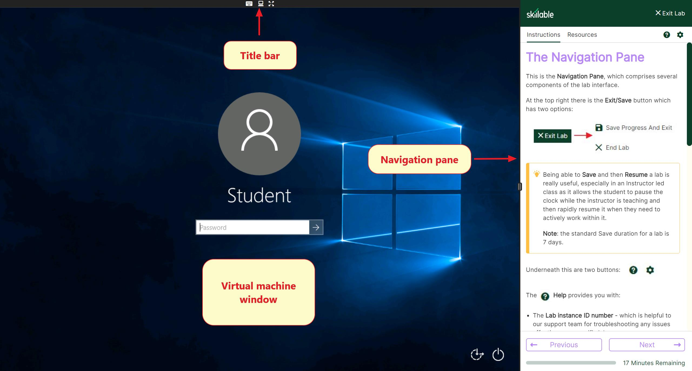
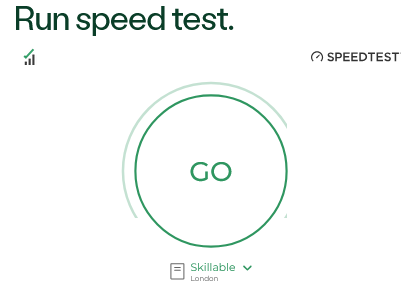

# Workshop environment 

This page provides a quick guide to the workshop environment that is provided by Skillable.

The screenshot below shows the components of the user interface we will review throughout this lab. Click the image to view it larger.

 

## Network status

View active incidents or upcoming maintenances in [Network status](https://status.skillable.com/).

 

## Speed test

If you are experiencing frequent disconnects or lag when controlling your machines, you may run a [spped test](https://www.skillable.com/customer-support/speed-test/). 

This test measures the most common factors that can impact connection quality to lab environments and works in all modern browsers with no need for additional plugins.

 

## Open a Support Ticket
Assistance with a course, lab or accessing your account.

- [Customer support](https://www.skillable.com/customer-support/)
- [Skillable Labs](https://docs.skillable.com/docs/skillable-labs)
- [Skillable Labs FAQ](https://docs.skillable.com/docs/student-faq)