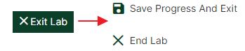
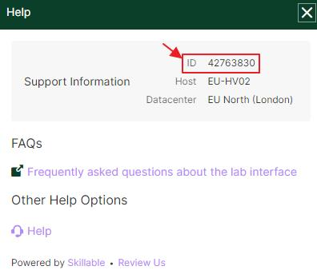
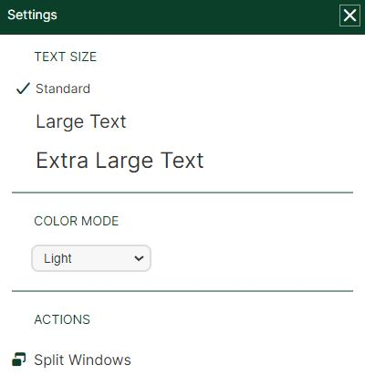
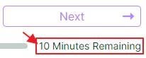

# The Navigation Pane

This is the Navigation Pane, which comprises several components of the lab interface.

At the top right there is the Exit/Save button which has two options:

> Note: Being able to Save and then Resume a lab is really useful, especially in an Instructor led class as it allows the student to pause the clock while the instructor is teaching and then rapidly resume it when they need to actively work within it.   Note: the standard Save duration for a lab is 7 days.

Underneath this are two buttons: 

The  Help provides you with:

* The **Lab instance ID number** - which is helpful to our support team for troubleshooting any issues affecting your specific lab.

* A link to our Frequently Asked Questions

* A link to our [Customer Support](https://www.skillable.com/customer-support/) page

    

The  Gear icon gives you the options to:

* Change the text size
* Alter the color mode:

    

    > Note: Your browser cache will remember the Mode you have selected, so future lab launches will also be with the same one.

At the bottom right under the Next button you will see the time remaining in your lab instance:

