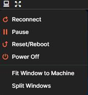

# The Resources Tab

To get started with the lab, you need to login to the Windows VM.

* Click the TypeText icon  to automatically enter the correct credentials into the login box.

* On the VM, press Enter or click the Sign In button.

* Alternatively, you can use the Commands menu e5ulavoh.jpg in the Title Bar and use the Ctrl+Alt+Delete and Type Password buttons. .

> Note that if there was another Virtual Machine (VM) in the lab you could switch between them using the dropdown menu in the center of the Title Bar!

## Display Menu

The Display menu  on the title bar allows you to control the VM such as restarting or reconnecting to it. It also allows you to set the browser to full screen.

 
